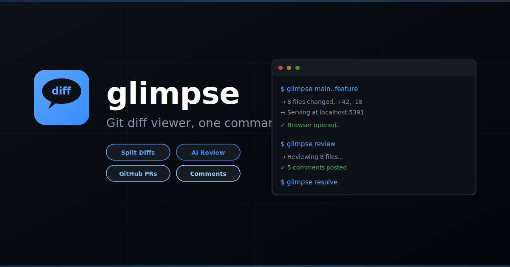

# glimpse — GitHub-style Git Diff Viewer CLI



[](https://github.com/dotbrains/glimpse/actions/workflows/ci.yml)
[](https://github.com/dotbrains/glimpse/actions/workflows/release.yml)
[](https://polyformproject.org/licenses/shield/1.0.0/)


Browser-based, GitHub-style diff viewer for git changes. View uncommitted changes, branch comparisons, commit ranges, and more with syntax-highlighted split diffs.

## Quick Start

```sh
# Install
go install github.com/dotbrains/glimpse@latest

# View uncommitted changes
glimpse

# View last commit
glimpse HEAD~1

# Compare branches
glimpse main..feature
glimpse main feature
glimpse --base main --compare feature

# View last 3 commits
glimpse HEAD~3

# Compare tags
glimpse v1.0.0 v2.0.0
```

## How It Works

1. Run `glimpse` inside any git repo.
2. It parses the git diff for the requested refs.
3. A local web server starts and opens your browser with a GitHub-style diff view.
4. Syntax-highlighted split diffs with file navigation, addition/deletion counts, and status badges.

Multiple repos can run simultaneously — each gets its own port. If you run `glimpse` in a repo that already has a running instance, it opens the existing one.

## Installation

### Via `go install`

```sh
go install github.com/dotbrains/glimpse@latest
```

### Via Homebrew

```sh
brew tap dotbrains/tap
brew install --cask glimpse
```

### Via GitHub Release

```sh
gh release download --repo dotbrains/glimpse --pattern 'glimpse_darwin_arm64.tar.gz' --dir /tmp
tar -xzf /tmp/glimpse_darwin_arm64.tar.gz -C /usr/local/bin
```

### From source

```sh
git clone https://github.com/dotbrains/glimpse.git
cd glimpse
make install
```

## Commands

| Command | Description |
|---|---|
| `glimpse` | View uncommitted changes (staged + unstaged) |
| `glimpse <ref>` | View changes since a ref (branch, tag, commit) |
| `glimpse <base> <compare>` | Compare two refs |
| `glimpse <base>..<compare>` | Range syntax |
| `glimpse list` | Show all running instances |
| `glimpse list --json` | Machine-readable instance list |
| `glimpse config init` | Create default config file |

## Options

```
--base <ref>       Base ref to compare from (e.g. main, HEAD~3, v1.0.0)
--compare <ref>    Ref to compare against base (default: working tree)
--port <port>      Custom port (default: auto-assigned from 5391)
--no-open          Don't open browser
--quiet            Minimal terminal output
--new              Stop existing instance and start fresh
```

## Dependencies

- **[Go](https://go.dev/)** >= 1.24
- **[git](https://git-scm.com/)**

## License

This project is licensed under the [PolyForm Shield License 1.0.0](https://polyformproject.org/licenses/shield/1.0.0/) — see [LICENSE](LICENSE) for details.
